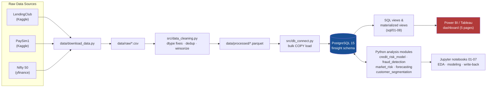

# FinSight360

An end-to-end financial risk analytics platform built on three real, unrelated public datasets —
LendingClub loans, PaySim mobile-money transactions, and NSE equity prices — unified into a single
PostgreSQL warehouse and analyzed through four modules: **credit risk**, **fraud detection**, **market
risk**, and **customer segmentation**. Every model, SQL view, and dashboard field is backed by code in
this repo and validated against a live database, not a static export.

## Bugs Found & Fixed

Six real bugs were found and fixed during this project — each one is documented in detail at its source
(module docstring, notebook markdown, or `reports/model_performance_report.md`), not just patched
silently. Listed here up front because catching and correcting these, rather than shipping wrong numbers,
is as much a part of this project as the models themselves.

| # | Bug | Fix |
|---|---|---|
| 1 | **Interval arithmetic bug** (`sql/06_kpi_views.sql`) — `step * INTERVAL '1 hour'` stored entirely in the interval's microseconds field, so `DATE_TRUNC('day', ...)` collapsed all 6.36M fraud transactions into 5 rows (one per `txn_type`) instead of a daily breakdown. | Anchored to a real `TIMESTAMP '2023-01-01'` base before truncating, so `step` buckets into proper calendar days. |
| 2 | **`loan_status` truncation risk** (`src/data_cleaning.py`) — raw values like `"Does not meet the credit policy. Status:Fully Paid"` exceed the `VARCHAR(30)` schema column and don't match any canonical status string used in every downstream `WHERE loan_status IN (...)` filter. | Strip the policy-exception prefix during cleaning so the true outcome status (`Fully Paid`) survives intact. |
| 3 | **`dti` sentinel value** (`src/data_cleaning.py`) — raw `dti` tops out at `999` (a data-entry sentinel, not a real debt-to-income ratio), with 13,739 loans >50 and 2,561 >100, silently distorting the feature's distribution. | Winsorize `dti` at the 1st/99th percentile, the same treatment already applied to `annual_income`/`loan_amount`. |
| 4 | **Unseeded `RANDOM()` sampling** (`notebooks/04_model_credit_default.ipynb`) — the 300K-loan modeling sample was originally drawn via SQL `ORDER BY RANDOM()`, so re-running the notebook silently pulled a different sample and drifted every reported metric. | Order by `MD5(loan_id::text)` instead — a fixed, reproducible pseudo-random ordering, same statistical properties. |
| 5 | **IsolationForest reproducibility bug** (`src/fraud_detection.py`) — a fixed `random_state=42` didn't make the fraud model reproducible: sklearn bootstraps trees by *positional* row index, and the SQL pull had no `ORDER BY`. Once the model's own write-back `UPDATE` rewrote the transactions table's physical row order, the same seed silently produced a different model (109→43→49 true positives across three runs). | Added `ORDER BY txn_id` to the pull query; verified deterministic via a bit-identical double-fit test. Full incident writeup in `reports/model_performance_report.md` §2. |
| 6 | **xgboost/shap version conflict** (`requirements.txt`) — `shap.TreeExplainer` broke against a newer XGBoost major release. | Pinned `xgboost<3.0` to restore SHAP compatibility. |

## Architecture



The Python modules read from Postgres **and** write scores/labels back to it (`is_flagged_rule`,
`anomaly_score`, `is_flagged_iforest`, `segment`, `risk_score`) — the dashboard layer never touches raw
CSVs or notebook output directly, only the database. `dashboards/DATA_MODEL.md` maps every table/view to
a specific dashboard page, visual, and field.

## Tech Stack

- **Data**: LendingClub (Kaggle), PaySim1 (Kaggle), Nifty 50 OHLCV (`yfinance`)
- **Warehouse**: PostgreSQL 15 (Docker)
- **Python**: pandas, numpy, SQLAlchemy, psycopg2, pyarrow
- **Modeling**: scikit-learn, XGBoost (`<3.0`, see Bugs Found & Fixed), SHAP, statsmodels
- **Viz / notebooks**: matplotlib, seaborn, Jupyter
- **Testing**: pytest
- **Dashboard**: Power BI / Tableau (connects live to PostgreSQL; see `dashboards/DATA_MODEL.md`)

## Folder Structure

```
FinSight360/
├── data/
│   ├── download_data.py        # pulls all 3 raw datasets into data/raw/
│   ├── raw/                     # raw CSVs (gitignored)
│   └── processed/                # cleaned Parquet output of data_cleaning.py (gitignored)
├── sql/
│   ├── 01_schema.sql            # finsight schema + all 4 base tables
│   ├── 02_load_data.sql         # (loading itself happens via src/db_connect.py, not raw SQL)
│   ├── 03_credit_risk_queries.sql
│   ├── 04_fraud_queries.sql
│   ├── 05_market_queries.sql
│   ├── 06_kpi_views.sql         # mv_credit_kpis, mv_fraud_kpis
│   ├── 07_market_and_segment_views.sql   # mv_market_risk_kpis (+portfolio row), mv_market_risk_correlation, mv_segment_summary
│   └── 08_dashboard_field_backfill.sql   # ALTER TABLE for anomaly_score/is_flagged_iforest
├── src/
│   ├── data_cleaning.py         # dtype fixes, dedup, winsorization for all 3 raw datasets
│   ├── data_inventory.py        # row/column/dtype/missingness report generator
│   ├── db_connect.py            # engine + bulk COPY loaders
│   ├── eda_utils.py             # shared plotting utilities (color system, chart helpers)
│   ├── credit_risk_model.py     # feature engineering, LR/XGBoost, threshold tuning
│   ├── fraud_detection.py       # rule engine + Isolation Forest, write-back functions
│   ├── customer_segmentation.py # RFM build, K-Means, risk_score backfill
│   ├── market_risk.py           # VaR (historical/parametric), volatility, Sharpe, correlation
│   ├── forecasting.py           # ARIMA per-ticker/portfolio forecasting vs. naive baselines
│   └── kpi_engine.py            # (stub — not yet implemented)
├── notebooks/
│   ├── 01_eda_credit_risk.ipynb
│   ├── 02_eda_fraud.ipynb
│   ├── 03_eda_market.ipynb
│   ├── 04_model_credit_default.ipynb
│   ├── 05_fraud_anomaly_detection.ipynb
│   ├── 06_customer_segmentation_rfm.ipynb
│   └── 07_var_and_forecasting.ipynb
├── reports/
│   ├── data_inventory.md
│   ├── sql_query_results.md
│   ├── model_performance_report.md
│   └── business_insights_summary.md
├── dashboards/
│   └── DATA_MODEL.md            # table/view -> dashboard page -> visual -> field spec
├── tests/
│   └── test_data_cleaning.py
├── docker-compose.yml            # PostgreSQL 15 container
├── requirements.txt
└── README.md
```

## How to Run

1. **Start PostgreSQL**: `docker compose up -d` — spins up Postgres 15 on `localhost:5433`
   (`docker-compose.yml`; defaults already match `src/db_connect.py`'s fallback env vars, so no `.env`
   file is required unless you want to override user/password/host/port).
2. **Install dependencies**: `pip install -r requirements.txt`
3. **Create the schema**: run `sql/01_schema.sql` against the `finsight` database (via `psql`, DBeaver, or
   any Postgres client) — must happen before step 6, since the loaders below only `TRUNCATE`/`COPY` into
   tables that already exist.
4. **Download raw data**: `python data/download_data.py` — pulls LendingClub + PaySim from Kaggle (needs
   `~/.kaggle/kaggle.json` or `KAGGLE_USERNAME`/`KAGGLE_KEY`) and 5 years of Nifty 50 OHLCV via `yfinance`
   (no auth needed) into `data/raw/`.
5. **Clean the raw data**: `python src/data_cleaning.py` — writes cleaned Parquet to `data/processed/`.
   Technically optional (`db_connect.py` cleans on the fly if the Parquet files are missing), but running
   it explicitly is faster on repeat loads and lets you inspect the cleaned output first.
6. **Load into PostgreSQL**: `python src/db_connect.py` — bulk-loads `finsight.loans`,
   `finsight.transactions`, `finsight.stock_prices` via `COPY` and computes `daily_return`.
7. **Run the notebooks, in order** (`jupyter lab` or `jupyter notebook` from `notebooks/`):
   `01` → `02` → `03` (EDA) → `04` (credit model) → `05` (fraud: writes `is_flagged_rule`,
   `anomaly_score`, `is_flagged_iforest` back to `finsight.transactions`) → `06` (segmentation: writes
   `segment`, `risk_score` back to `finsight.customers`) → `07` (VaR/Sharpe/correlation + forecasting).
8. **Create the KPI/dashboard views**: run `sql/06_kpi_views.sql`, `sql/07_market_and_segment_views.sql`,
   and (if not already applied) `sql/08_dashboard_field_backfill.sql` — run **after** notebooks 05/06, since
   `mv_fraud_kpis`/`mv_segment_summary` depend on the columns those notebooks populate.
9. **Connect the dashboard**: point Power BI / Tableau at the `finsight` schema per
   `dashboards/DATA_MODEL.md`, which maps every table/view to a specific page, visual, and chart type.
10. **Run the tests**: `pytest tests/`

## Key Findings

**Credit risk** (`reports/model_performance_report.md`): default rate climbs sharply and monotonically by
LendingClub grade — **3.28%** for Grade A up to **38.07%** for Grade G. Our independent model (XGBoost,
AUC-ROC **0.688**) deliberately excludes grade/sub_grade/interest_rate/installment as pricing-decision
leakage — confirmed empirically, since adding grade back in inflates AUC to 0.712 and grade instantly
dominates feature importance. At a ~25%-of-portfolio review threshold, the model catches **44% of
defaulters at 35% precision**.

**Fraud detection**: a single hand-written balance-drain rule achieves **100% precision, 97.5% recall**
(8,008/8,213 fraud caught, zero false positives). An Isolation Forest tested as a secondary detector on
the 205 residual fraud cases the rule misses recovers **18.5%** of them (38/205) — a real but modest
signal, at **0.48% precision** on its incremental flags.

**Market risk** (`notebooks/07_var_and_forecasting.ipynb`): the equal-weighted 5-ticker portfolio's 1-day
95% historical VaR is **1.55%**, versus **2.11%** average for any single ticker — a real, measurable
diversification effect. TCS.NS/INFY.NS (both IT) are the most correlated pair (**0.73**); ICICIBANK.NS
currently has the best risk-adjusted return (Sharpe **0.62**).

## Known Limitations

- **PaySim's 31-day simulated timespan.** `step` is hours since an arbitrary simulation start (1–743, ~31
  simulated days), not a real calendar range — fraud/segmentation time-series patterns reflect a single
  simulated month, not real seasonality, and should be read as relative-ordinal, not calendar-accurate.
- **Three datasets, three unrelated time axes.** Loan `issue_date` (real, 2007–2018), PaySim's synthetic
  ~31-day window (anchored to an arbitrary `2023-01-01` for schema convenience only), and NSE `trade_date`
  (real, 2021–2026) cannot share a single date filter without misrepresenting at least one of them — see
  `dashboards/DATA_MODEL.md`'s "Read this first" section.
- **Isolation Forest's fraud lift is modest, not dramatic.** After fixing the reproducibility bug (#5
  above), the verified, stable result is **18.54% residual recall** at 0.48% precision — real signal, but
  a limited one; earlier (buggy) numbers overstated this at 44.39%.
- **ARIMA does not beat naive baselines** on this data. Fit per ticker + portfolio index over a strict
  chronological 60-day holdout, ARIMA's MAPE ties the naive last-value baseline within a fraction of a
  percentage point on every one of 6 series, and loses to a naive seasonal baseline on all 6 — with
  ~1,239 daily observations per ticker and no strong trend/seasonal structure, this is an honest negative
  result, not a deployable forecasting model (see `notebooks/07_var_and_forecasting.ipynb`).

## Screenshots

*Dashboard screenshots will be added here once the Power BI build (per `dashboards/DATA_MODEL.md`) is
finalized.*

## Further Reading

- `dashboards/DATA_MODEL.md` — full dashboard build spec (table/view → page → visual → field)
- `reports/model_performance_report.md` — full credit risk + fraud detection model writeup
- `reports/business_insights_summary.md` — 1-page CRO memo
- `reports/sql_query_results.md` / `reports/data_inventory.md` — raw SQL/EDA outputs
